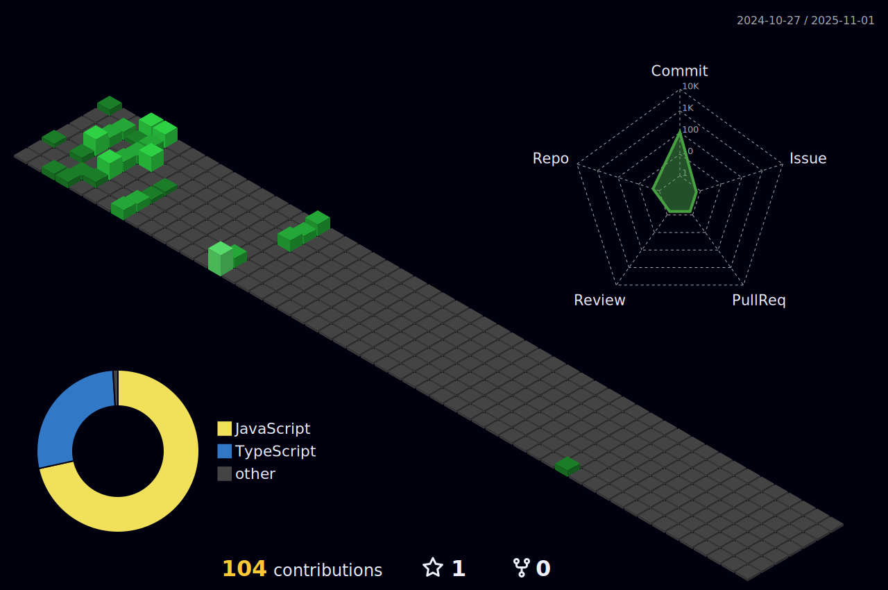

    

 

<h3 align="left">
    Hi There! 🌱
</h3>

    I'm a 3rd year Computer Science student at the University of British Columbia in Vancouver, originally from Calgary. As an aspiring UI/UX designer, I have a passion for crafting engaging and user-friendly layouts for various projects. Beyond coding, I have a strong interest for graphic design and I enjoy playing badminton. Whether I'm creating digital artwork or playing on the court, I always strive to do my best!

 

<table border="0" align="center">
  <tr>
    <td></td>
    <td></td>
  </tr>
</table>

<!--  -->

    

