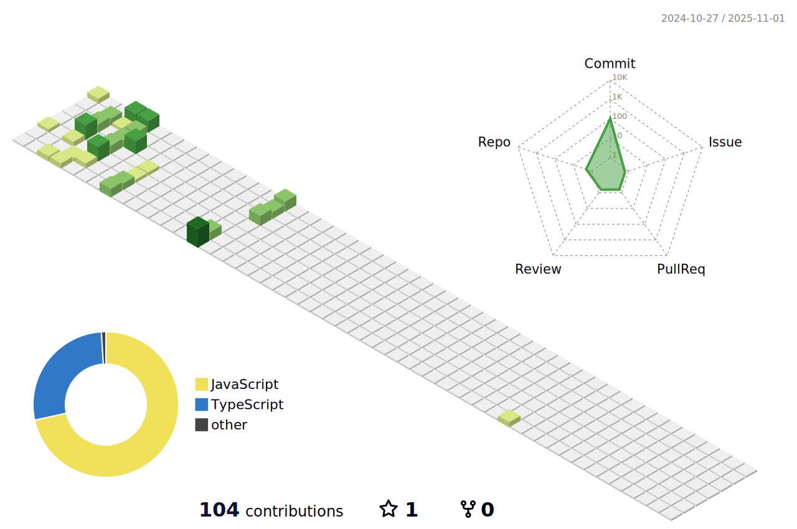

<!--
**LeoShangTang/LeoShangTang** is a ✨ _special_ ✨ repository because its `README.md` (this file) appears on your GitHub profile.

Here are some ideas to get you started:

- 🔭 I’m currently working on ...
- 🌱 I’m currently learning ...
- 👯 I’m looking to collaborate on ...
- 🤔 I’m looking for help with ...
- 💬 Ask me about ...
- 📫 How to reach me: ...
- 😄 Pronouns: ...
- ⚡ Fun fact: ...
-->

    

    I'm a 3rd year Computer Science student at the University of British Columbia in Vancouver, originally from Calgary. As an aspiring UI/UX designer, I have a passion for crafting engaging and user-friendly layouts for various projects. Beyond coding, I have a strong passion for graphic design and enjoy playing badminton. Whether I'm creating digital artwork or playing on the court, I always strive to do my best!

